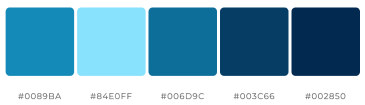

# Dog Age Calculator App Android

This mobile application helps you to determine how old your dog is in human years by using a simple calculation method provided by the American Kennel Club (AKC).

Source: **[How to calculate dog years to human years](https://www.akc.org/expert-advice/health/how-to-calculate-dog-years-to-human-years/)**

Additionally, the program provides a fun and educational element by retrieving a random dog fact from the animality API.

Click **[here](https://animality.xyz/)** to read the full documentation of the API.

_! No API key needed !_

This code is an example of how to create a navigation-based app in Jetpack Compose, an Android UI toolkit for building native Android apps.

The application defines a navigation graph with three composable screens ("Home," "Info," and "Chart"), each of which is associated with a specific route. The NavHost composable is used to set up this navigation graph, with the start destination set to "Home."

Each screen is defined using a composable function, which is a lightweight and efficient way to build UI components in Jetpack Compose. Each screen is composed of several subcomponents, including a top app bar with navigation and dropdown menu functionality, input fields for entering data, and a button for performing a calculation based on the user's input.

The MainScreen composable is the main screen of the app and contains all the other components. It includes a Scaffold composable, which provides a basic app layout that includes a top app bar, content area, and optional bottom navigation. The top app bar is customized using the MainTopBar composable function, which displays the app name and provides a dropdown menu for navigating to the "Info" and "Chart" screens.

The MainScreen also includes several other composable functions for displaying UI components, such as AgeField, DogSizeList, and Calculation, which allow the user to enter their dog's age and size, select a size from a list of options, and perform a calculation based on the input values.

The application implements MVVM architecture and all the strings are saved under the resource file.

## How to get started
1. Clone the repository to your local machine
2. Build and run the application

_! Make sure your device is connected to internet !_

## Color scheme used in the application

## How the main screens of the application look like

